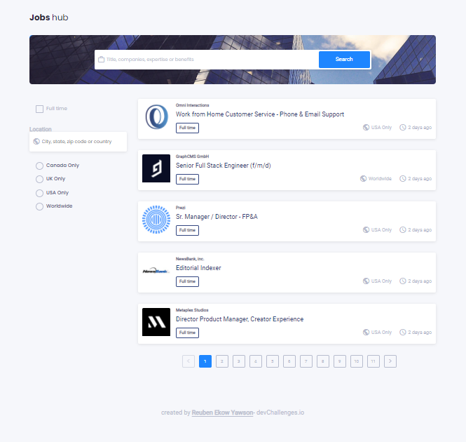
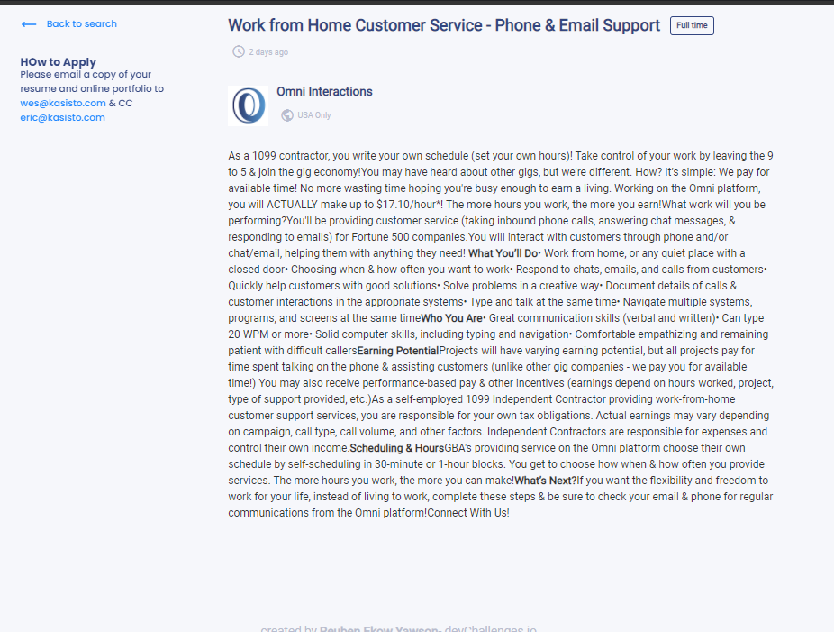

<h1 align="center">Jobs Hub</h1>

  <h3>
    <a href="">
      Demo
    </a>
  </h3>

## Table of Contents

- [Hme page](#home)
  - [Built With](#built-with)
- [Features](#features)
- [How to use](#how-to-use)
- [Contact](#contact)
- [Acknowledgements](#acknowledgements)

## Landing Page

## Description Page

### Built With

* React
* Axios
* HTML React Parser
* [Remote Jobs API](https://remotive.com/api/remote-jobs)

## Features

This is a finial project created and submitted by Reuben Ekow Yawson to my training supervisor at [AmaliTech](https://amalitech.org).

## How To Use

To clone and run this application, you'll need [Git](https://git-scm.com) and [Node.js](https://nodejs.org/en/download/) (which comes with [npm](http://npmjs.com)) installed on your computer. From the command line you have to do the following:

# Install dependencies
$ npm install

Then

Run the app
$ npm start

## Contact

<h3>#Reuben Ekow Yawson</h3>

- GitHub [Reuben](https://github.com/Reuben-Ekow-Yawson)
- LinkedIn [reuben](www.linkedin.com/in/reuben-ekow-yawson)
